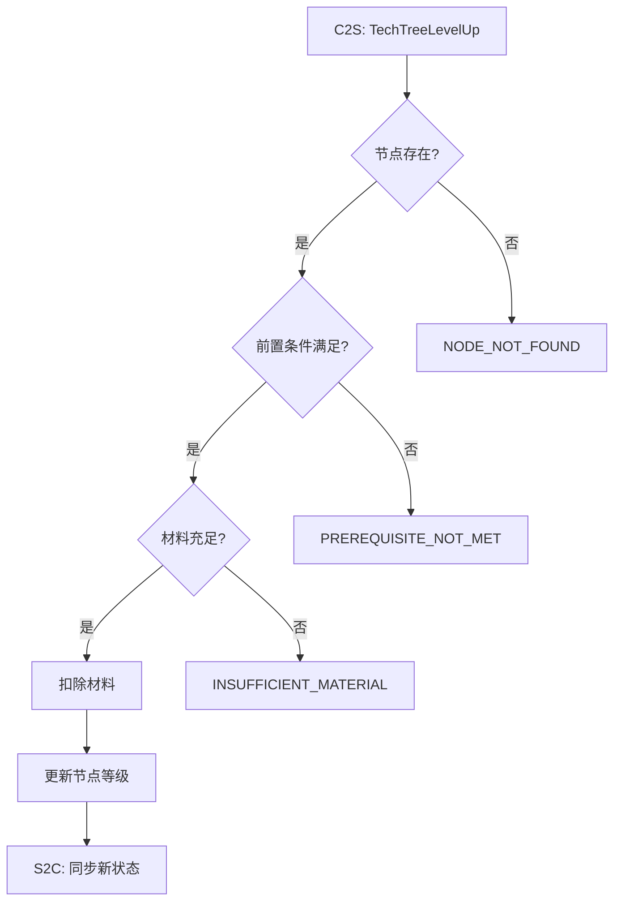

# Project Report Skill

## 概述

一键生成固定格式的交互式 HTML 项目报告，纵览各功能模块的进度、配表覆盖、协议设计、技术债分布和用例工作流程。

报告采用三阶段流水线架构：
1. **Phase 1 — 数据收集**：Python 脚本自动扫描 + 依赖分析 + Scenario 预提取，0 token 消耗
2. **Phase 2 — AI 增强**：AI 仅需根据预提取的 WHEN/THEN 文本生成 Mermaid 流程图（无需读取 spec.md 原文件）
3. **Phase 3 — HTML 渲染**：Python 脚本将数据填充到固定模板，输出单文件 HTML

## 文件布局

```
.codebuddy/skills/project-report/
├── SKILL.md                          # 本文件 — Skill 定义和执行流程
├── scripts/
│   ├── scan_project.py               # Phase 1: 数据收集
│   └── render_report.py              # Phase 3: HTML 渲染
├── templates/
│   ├── report_template.html          # 固定 HTML 模板
│   └── mermaid.min.js                # Mermaid.js 本地库文件
└── output/                           # 生成结果目录
    ├── report_data.json              # Phase 1 输出
    ├── ai_enhanced_data.json         # Phase 2 输出
    └── project_report.html           # 最终报告
```

## 执行流程

> AI 加载本 Skill 后，**必须严格按以下三个 Phase 顺序执行**。

### Phase 1: 数据收集（Python 脚本）

**执行命令**：
```bash
python .codebuddy/skills/project-report/scripts/scan_project.py
```

**脚本行为**：
- 扫描 `openspec/changes/` 目录，识别 active 和 archived change
- 解析每个 change 的 proposal.md / design.md / tasks.md / specs/*/spec.md
- **[新] 预提取每个 Scenario 的 WHEN/THEN 原始文本**（AI Phase 2 不再需要读取 spec.md 文件）
- 扫描 Java 源码中的 TODO/FIXME 注释（三个模块目录）
- 提取配表、attr 属性、协议引用
- **[新] 自动执行跨 change 依赖分析**（纯集合运算，检测共享配表/attr/协议）
- 输出 `output/report_data.json`（含 `cross_change_dependencies` 字段）

**验证**：脚本执行成功后，确认 `output/report_data.json` 已生成且内容合理。

### Phase 2: AI 增强

**前置条件**：Phase 1 已成功输出 `report_data.json`

**AI 执行步骤**：

1. **读取** `output/report_data.json`，了解所有 change 和 scenario 列表
2. **对每个 change 的每个 spec 的每个 scenario**：
   - **直接从 JSON 中读取** scenario 的 `when` 和 `then` 文本（Phase 1 已预提取，**无需读取 spec.md 文件**）
   - 根据 WHEN/THEN 描述，生成一个 Mermaid 流程图
3. **跨 change 依赖已由 Phase 1 脚本自动分析**（`report_data.json` 中的 `cross_change_dependencies` 字段），AI 可在此基础上补充 `functional` 类型的语义依赖
4. **输出** `ai_enhanced_data.json` 到 `output/` 目录

#### 5.1 AI 增强流程详细步骤

AI 在执行 Phase 2 时，必须按以下顺序操作：

1. **读取** `output/report_data.json`
2. **构建 scenario 清单**：遍历 `report_data.changes[*].specs[*].scenarios[*]`，每个 scenario 已包含 `name`、`when`、`then` 字段
3. **逐个生成流程图**：
   - 对每个 scenario，**直接使用 JSON 中的 `when` 和 `then` 文本**生成 Mermaid `graph TD` 代码
   - **无需读取 spec.md 文件**（Phase 1 已预提取所有 WHEN/THEN 文本）
4. **检查跨 change 依赖**：`report_data.json` 中已有 `cross_change_dependencies` 字段（脚本自动分析），AI 可选择性补充语义级别的功能依赖
5. **组装 JSON 并写入文件**

#### 5.2 Mermaid 流程图生成规范

**布局规则**：
- 使用 `graph TD`（Top-Down）布局
- 单张图节点数 ≤ 15，超过时使用 `subgraph` 分组

**节点命名规则**：

| 节点类型 | ID 前缀 | 形状 | 示例 |
|---------|---------|------|------|
| 入口（C2S 请求） | `A` | 方框 `[]` | `A[C2S: TechTreeLevelUp]` |
| 校验判断 | `B`, `C`, `D` | 菱形 `{}` | `B{节点存在?}` |
| 业务操作 | `F`, `G`, `H` | 方框 `[]` | `F[扣除材料]` |
| 输出/通知 | `Z`, `Y` | 方框 `[]` | `Z[S2C: 同步新状态]` |
| 错误码 | `E1`, `E2` | 方框 `[]` | `E1[NODE_NOT_FOUND]` |
| 外部调用 | `X1`, `X2` | 方框 `[]` | `X1[RPC: 跨服查询]` |

**边样式规则**：
- 正常流程：实线箭头 `-->` 或带标签 `-->|是|`
- 错误分支：带失败标签 `-->|否| E1[ErrorCode]` 或 `-->|失败| E1[xxx]`
- 外部调用：虚线 `-.->` 或带说明标签

**复杂度限制**：
- 每个 scenario 的流程图 ≤ 15 节点
- 如果 scenario 步骤超过 15 步，拆分为主流程 + 子流程（使用 `subgraph`）
- 优先保留核心判断和操作，省略重复性校验

**示例**：



#### 5.3 跨 Change 依赖分析规范

> **注意**：共享资源类型的依赖（shared_config、shared_attr、shared_protocol）已由 Phase 1 脚本自动分析，
> 结果存储在 `report_data.json` 的 `cross_change_dependencies` 字段中。
> Phase 3 渲染时会自动合并脚本分析和 AI 补充的依赖（以脚本结果优先，相同 from/to 对不重复）。

AI 在 Phase 2 中**可选**补充 `functional` 类型的语义依赖：

**补充分析步骤**（可选）：
1. 阅读各 change 的 proposal `why` 和 `what_changes` 字段
2. 如果发现一个 change 在语义上依赖另一个 change 的功能（如"建筑-房间集成"依赖"建筑建造"），添加为 `functional` 依赖
3. 脚本已通过名称包含关系做了初步功能依赖检测，AI 可以补充脚本无法识别的语义依赖

**依赖类型**：
- `shared_config`: 共享配表（如两个 change 都引用 `ProjecttBuildingConf`）
- `shared_attr`: 共享 attr 字段
- `shared_protocol`: 共享协议
- `functional`: 功能依赖（A 是 B 的前置条件）

#### 5.4 ai_enhanced_data.json 输出指令模板

AI 生成完成后，**必须使用 `write_to_file` 工具**将完整的 JSON 写入以下路径：

```
.codebuddy/skills/project-report/output/ai_enhanced_data.json
```

**JSON 格式**（严格遵循）：

```json
{
  "workflows": {
    "<change-name>": {
      "<spec-name>": {
        "<scenario-name>": "graph TD\n    A[入口] --> B{判断}\n    B -->|是| C[操作]\n    B -->|否| E1[错误码]"
      }
    }
  },
  "cross_change_dependencies": [
    {
      "from": "<change-name-A>",
      "to": "<change-name-B>",
      "reason": "共享配表 ResXxx / attr字段 YyyInfo / 功能依赖描述"
    }
  ]
}
```

**关键约束**：
- `workflows` 中的 key 层级必须与 `report_data.json` 中的 `changes[*].name` → `specs[*].name` → `scenarios[*]` 一一对应
- Mermaid 代码中的换行使用 `\n`，缩进使用空格
- Mermaid 代码不要包含 ` ``` ` 围栏，只包含纯 Mermaid 语法
- 没有 spec 的 change，其 workflows 值为空对象 `{}`
- `cross_change_dependencies` 数组可以为空 `[]`
- 不要包含 `project-report-skill` 这个 change 本身

### Phase 3: HTML 渲染（Python 脚本）

**执行命令**：
```bash
python .codebuddy/skills/project-report/scripts/render_report.py
```

**脚本行为**：
- 读取 `output/report_data.json`（必需）
- 读取 `output/ai_enhanced_data.json`（可选，不存在时流程图区域显示占位文本）
- 读取 `templates/mermaid.min.js`，内嵌到 HTML `<script>` 标签
- 读取 `templates/report_template.html` 模板
- 将 JSON 数据注入模板的 `<script>` 数据区
- 输出 `output/project_report.html`
- **自动用系统默认浏览器打开报告**

**验证**：脚本执行后会自动弹出浏览器，确认：
- Tab 切换正常
- 子页签切换正常
- Mermaid 流程图正确渲染
- 进度数据准确

## 注意事项

- 所有 Python 脚本必须包含 `# -*- coding: utf-8 -*-` 和 `sys.stdout.reconfigure(encoding='utf-8')`
- 禁止使用 PowerShell 命令，使用 `python <脚本路径>` 执行
- 输出的 HTML 文件是完全自包含的单文件，离线可用
- Mermaid.js 作为本地文件引入，存放在 `templates/mermaid.min.js`
- 如果 `ai_enhanced_data.json` 不存在，渲染时流程图区域显示 "未生成流程图"
